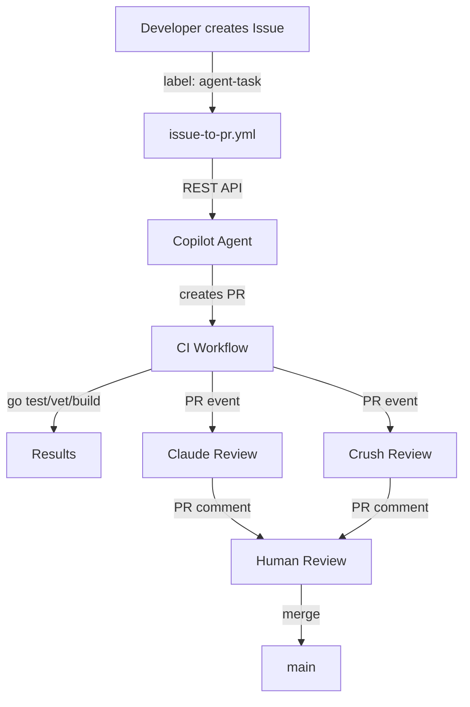

# Architecture

System overview of the agentic workflow demo.

## System Overview

A Go HTTP service (`agent-demo-server`) with 3 agent harnesses wired via GitHub Actions.



## Agent Config Files

| Harness | Config File | Instructions File |
|---------|------------|-------------------|
| Copilot | `.github/agents/feature-implementer.md` | `.github/copilot-instructions.md` |
| Claude Code | `.github/workflows/claude-review.yml` | `.claude/CLAUDE.md` |
| Crush | `crush.json` | `AGENTS.md` |

## Request Flow

```
HTTP Request
  → Recovery (catch panics)
  → Logging (log method/path/duration)
  → RequestID (inject X-Request-ID)
  → MetricsCounter (increment request count)
  → Handler (route-specific logic)
  → WriteJSON (encode response)
HTTP Response
```

## Data Flow: Agent Review Pipeline

```
PR opened
  → ci.yml: go vet + test -race + build + coverage
  → claude-review.yml: gh pr diff → Anthropic API → PR comment
  → crush-review.yml: crush --yolo → PR comment
  → Human reviews all comments → merge
```

## Key Design Decisions

1. **Zero dependencies** — Go stdlib only for simplicity and auditability
2. **Configurable model** — `REVIEW_MODEL` GitHub variable for easy model updates
3. **Manual label trigger** — `agent-task` label prevents accidental agent invocation
4. **Intentional bug** — `buggy-counter` handler has data race for review demo

---
*Last updated: 2026-05-30*
